<!-- SPDX-License-Identifier: AGPL-3.0-or-later -->
# CFMOTO-first "Cockpit" redesign + Overtake map stack

A ground-up **Jetpack Compose** cockpit for the CFMOTO MotoPlay / EasyConnect dash, built
CFMOTO-first (450NK, no T-Box) while keeping the classic app fully intact as a safety net. The map
subsystem was extracted into a standalone supplier library — **Overtake** — that this fork consumes
via a Gradle composite build.

> Status: the classic `MainActivity` flow is untouched and still shipped; the cockpit is a **second
> launcher** ("Overtake") so nothing regresses. One connection-recovery fix is still in flight (see
> *Known pending* at the end).

## The map on the real 450NK dash

MapLibre (OpenFreeMap **Liberty**, vector + 3D) rendered on the bike dash in **day** mode — projected
from the phone over the existing PXC/H.264 pipeline, phone free:

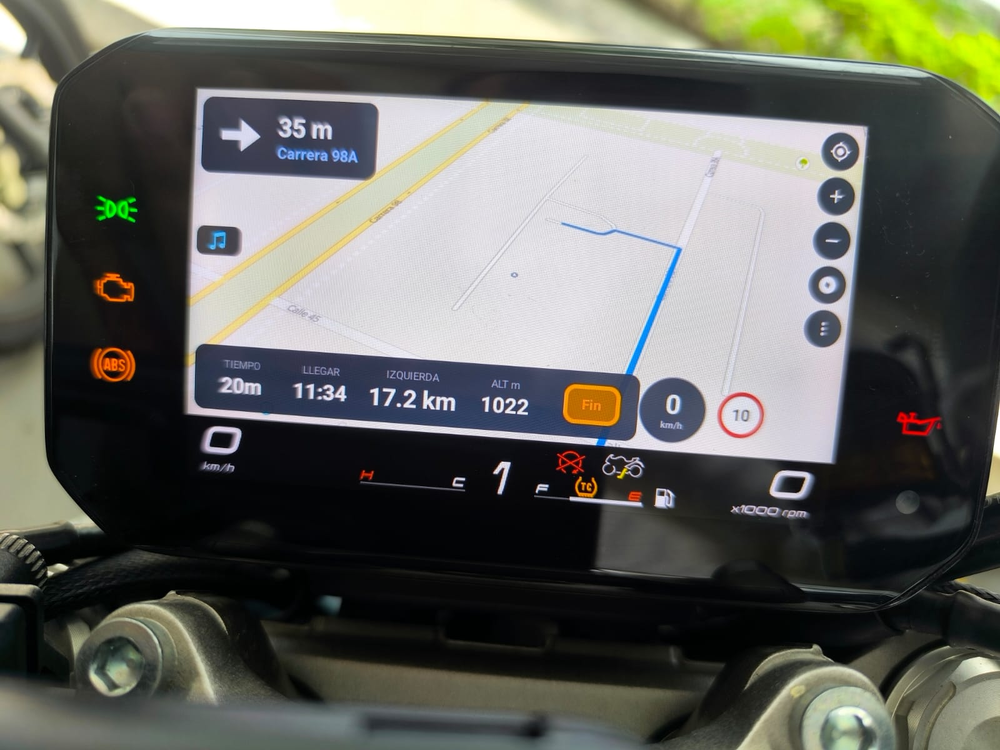

| MapLibre (vector 3D) | osmdroid (raster) |
| --- | --- |
| 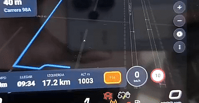 | 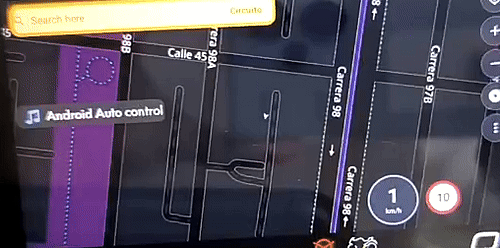 |

## The cockpit screens (phone)

| Dashboard | Cockpit — the map (search + music) | Settings |
| --- | --- | --- |
| 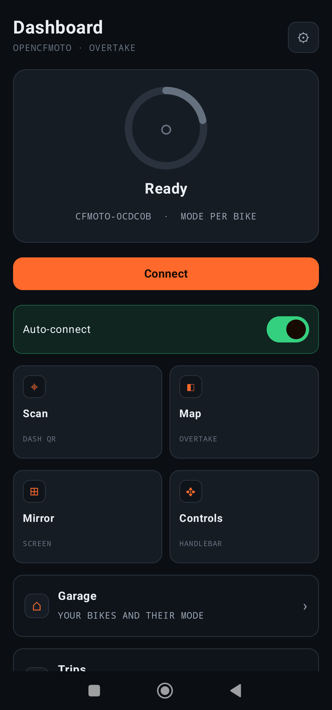 | 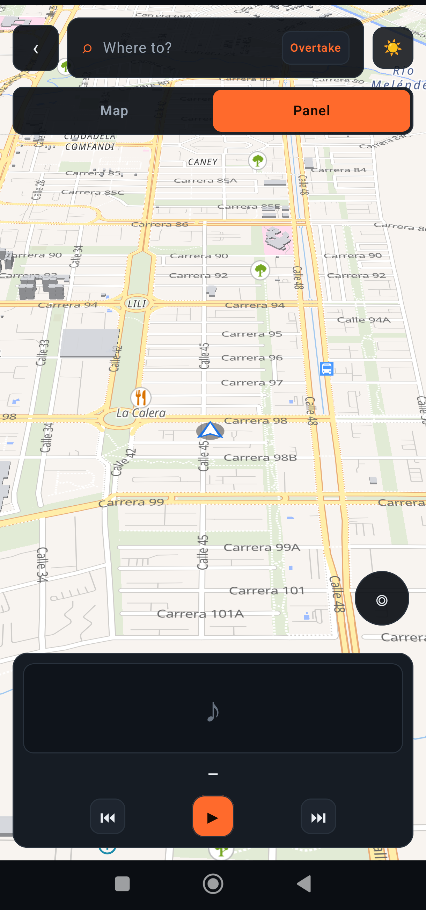 | 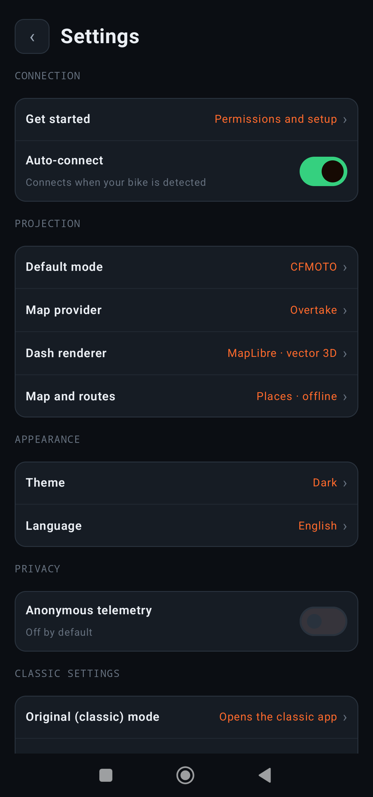 |

| Scan — dash QR | Controls — handlebar | Mirror — phone → dash |
| --- | --- | --- |
| 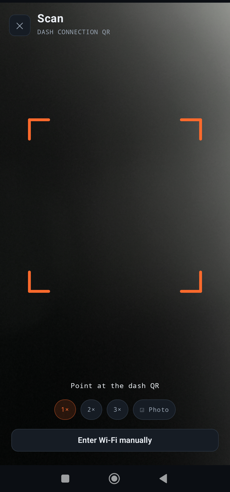 | 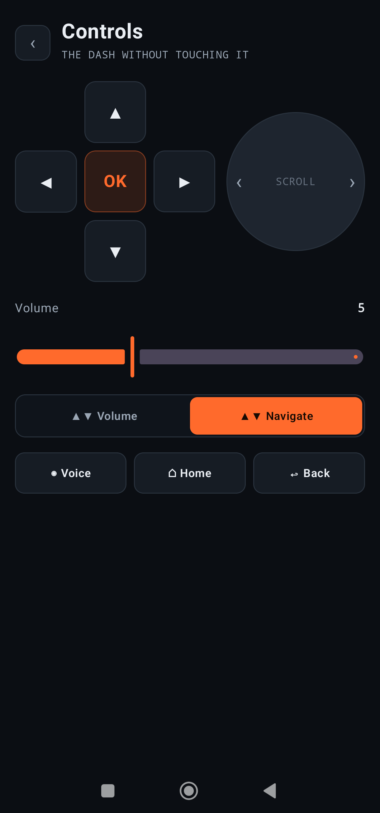 | 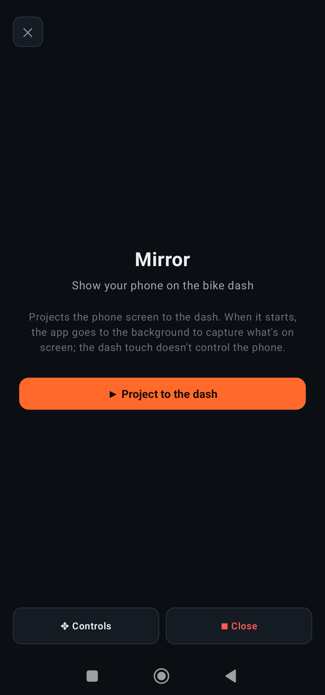 |

| Garage — per bike | Offline maps — Mapsforge | Language |
| --- | --- | --- |
| 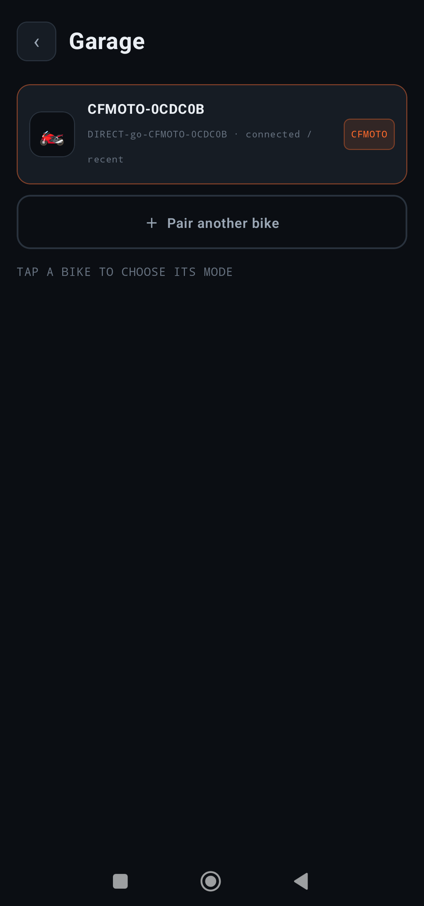 | 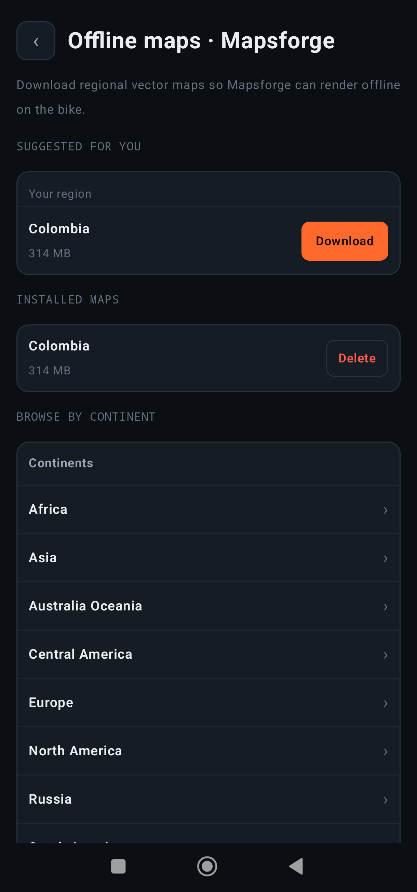 | 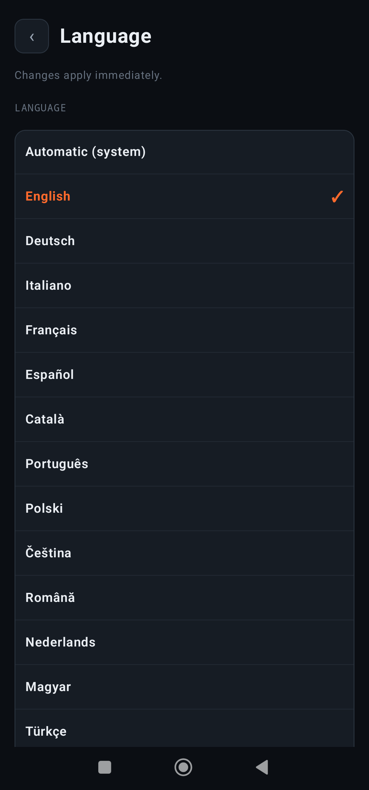 |

*The map you ride with is the **Cockpit** (top search "¿A dónde vamos?" + inline provider selector +
the `Mapa | Panel` toggle) — opened from the Dashboard's Map tile.*

## What's in this PR

### 1. Compose cockpit (7 screens) — a second launcher, classic app kept
Dashboard, Settings, Garage, Scan (CameraX + MLKit), Controls (D-pad/rotary/volume → real input
sinks), Mirror (SurfaceView), and Map — all rewritten in Compose (Material 3, `StateFlow` view
models, DataStore, Navigation-Compose). Design system ported from the classic theme (ignition orange
`#FF6A2C`, cockpit dark). Edge-to-edge insets fixed for Android 15. **Light / dark / auto theme** for
the whole cockpit UI.

### 2. CFMOTO-first connection
The Wi-Fi + PXC link engine was extracted out of the god-`MainActivity` into an app-scoped
`CfmotoConnect`, so the cockpit connects (join bike Wi-Fi → project the own map) without ever showing
the classic UI. Auto-connect via `CompanionDeviceManager`; a first-run consent popup; developer-mode
gate (diagnostics/RE tools hidden behind 7-taps-on-version); anonymous telemetry **off by default**.

**Auto-connect** — pair the bike once (`CompanionDeviceManager` association), then it connects on its own when the bike's Wi-Fi is in range. Toggle it from the Dashboard. A background `CompanionDeviceService` wakes the app and connects in the CFMOTO own-map mode even when the app is closed (foreground auto-connect is the fallback on older devices).

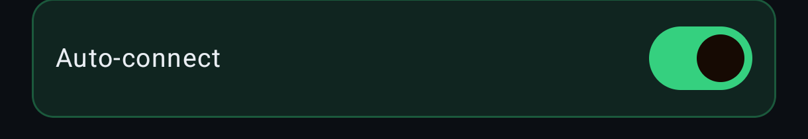

### 3. Cockpit — an Android-Auto-like module, without Android Auto
Renders our OWN content to a `Presentation` on a private `VirtualDisplay` (phone free), and reads
third-party apps by **notification / MediaController** instead of projecting them: music via
`MediaSessionManager` (no audio hijack), turn-by-turn and calls via a `NotificationListenerService`.
A `Mapa | Panel` toggle switches full-map vs the widget dash. Principle: **decouple phone ↔ bike** —
same state, two renderings (phone = comfortable control, dash = glanceable).

### 4. Overtake — the map SUPPLIER library (the big one)
The whole map stack was extracted into a separate Gradle project, **`:overtake-maps`**
(`dev.overtake.maps`, repo `Authoritt/overtake`), consumed here via
`includeBuild("../overtake")` + `implementation("dev.overtake:overtake-maps:…")`. It exposes four
orthogonal contracts behind a factory (`OvertakeMaps.create(config)` → `MapProvider`):

- **`MapRenderer`** — three renderers, all screen-off capable, chosen at runtime:
  **MapLibre** GL (Liberty vector + 3D, default), **osmdroid** (raster), **Mapsforge** (offline
  vector `.map`, Canvas). The `attach(context, host)` seam keeps `VirtualDisplay`/`Presentation`/PXC
  in the fork (the library has zero projection code).
- **`Router`** — `RouterChain`: ORS → Valhalla (`motorcycle`) → OSRM online, BRouter (`.rd5`,
  vendored MIT) + an Overpass road graph offline. Connectivity-aware chooser + **sticky route**
  (online↔offline never re-routes or swaps the map underfoot, Google-Maps-style). A
  `motorcycle_curvy` BRouter profile (fixes a 2× detour, biases to curvy roads).
- **`PlaceSearch`** — Google-class ranking over Photon + Nominatim + Android Geocoder + Overpass.
- **`OfflineManager`** — Mapsforge `.map` downloads, MapLibre region packs, tile cache, POI index.

`MapProvider` is a sealed interface: `Native(renderer, router, search)` | `GoogleAA` | `WazeAA`
(Google and Waze reach the dash via Android Auto — the only sanctioned phone-free path for their
pixels).

**Dash view (AA):** when the provider is Google or Waze, the Cockpit shows a **Dash view** button
that opens the live Android Auto HUD (their screen as projected to the dash) mirrored on the phone,
with controls. It is shown only in AA mode — Overtake draws its own map and never uses AA — so it never
competes with the Overtake pipeline. Reuses the proven in-app dash Activity.

### 5. Dash rendering fix — MapLibre "green screen"
MapLibre GL renders continuously and **uncapped** (~60–115 fps); the dash receives timestamp-less
H.264 access units paced by *arrival rate*, so the flood greened its real-time decoder (green↔map
flicker / partial macroblocks) while osmdroid's calm ≤30 fps stream was fine. Fixed by capping the
**encoder input** (`MediaFormat.KEY_MAX_FPS_TO_ENCODER`) + `MapView.setMaximumFps` — deterministic,
independent of MapLibre's own governor (which mis-paces on a secondary display).

### 6. Offline maps with a real download UX
A native "Offline maps · Mapsforge" screen: browse the mapsforge.org catalog (continent → country →
sub-region), a **"your region"** suggestion detected best-effort (GPS / SIM / locale, no new
permission), installed-maps management, and a **resumable, app-scoped** downloader — HTTP `Range`
resume (keeps the `.part` on transient error, never restarts from zero), auto-retry with backoff,
and a foreground service so leaving the screen doesn't kill a 300 MB+ transfer. Strict gate: if
Mapsforge is selected with no `.map`, a clear "download a map" card shows instead of silently falling
back to osmdroid.

### 7. Day / night / auto — on the map, live to the dash
A persistent one-tap toggle **on the map itself** (both the Map screen and the cockpit) cycles
Auto → Day → Night; it writes the same `NightPrefs` the Settings option uses (kept), and flips a
**live projecting dash** in place via a `DashRemote` theme channel — no PXC reconnect.

### 8. In-app language picker
Settings → Language: "Automatic (system)" + the 14 bundled locales by native name, applied instantly
via the AndroidX per-app locales API (self-persisting, API 29–36).

### 9. First-run onboarding ("Empezar")
A native Compose get-started flow that requests the runtime permissions with live status ticks
(Android Auto + overlay optional — CFMOTO-first). Shown **first only on a fresh install** (read before
first composition = no flicker; an upgrader with permissions already granted, or a deep-link, goes
straight to the dashboard; a "Skip" affordance means the rider is never trapped). Reachable later from
Settings.

### 10. Legacy / original mode
A clear **"Original (classic) mode"** row in Settings opens the classic `MainActivity` (previously
only reachable through the developer Diagnostics row).

### 11. Developer mode + in-app logs
Developer mode is **off by default** and unlocked the classic way — **7 taps on the Version row**. It
gates a developer group in Settings (diagnostics / reverse-engineering tools) that stays hidden in
normal use; anonymous telemetry is **off by default** (explicit consent). The old "Diagnostics" entry
used to bounce the rider out to the classic app just to read logs — it is now a **native in-app log
viewer**: the app's own session log, live-updating, monospace and selectable, with **Share / Copy /
Clear**. Diagnostics never leave the cockpit, and the separate "Original (classic) mode" row is the
only thing that opens the legacy app.

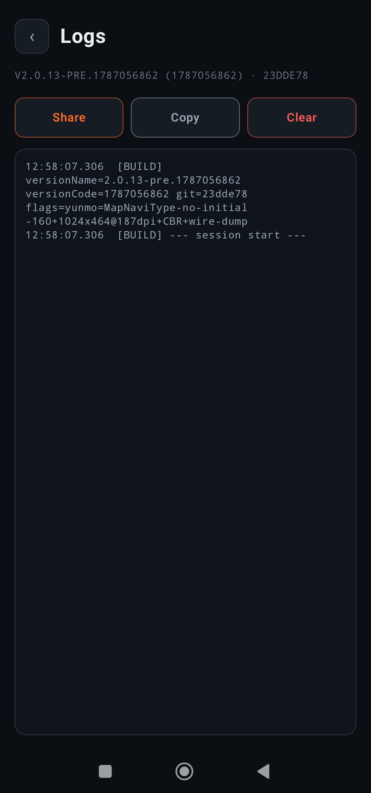

### 12. Plumbing
Full **i18n** (300+ strings moved to resources, English base + Spanish, no hardcoded language); a
mode-aware foreground-service notification (the own-map projection no longer mislabels itself
"Android Auto"). The classic app's update mechanism (`UpdateChecker` → GitHub Releases → browser) is
preserved unchanged, and the cockpit's "Check for update" reuses that same check + opens the release in
the browser.

## Compatibility / how to build
- **Composite build:** this fork consumes the separate `Authoritt/overtake` repo (`feat/overtake-maps`)
  via `includeBuild("../overtake")`. Check out both side by side before building `assembleDebug`.
- The classic app path (`MainActivity`, the AA flow, multi-bike support) is **not** removed — the
  cockpit is additive (a second launcher), so existing behavior is preserved.
- AGPL-3.0; new cockpit files carry SPDX headers; `LICENSE` + `NOTICE` present.

## Testing status
Compose screens, the map renderers/day-night, language, onboarding gate, and the legacy row are
verified on a real device. On-the-bike (450NK) verified: MapLibre/osmdroid/Mapsforge project to the
dash, the green fix, day/night.

